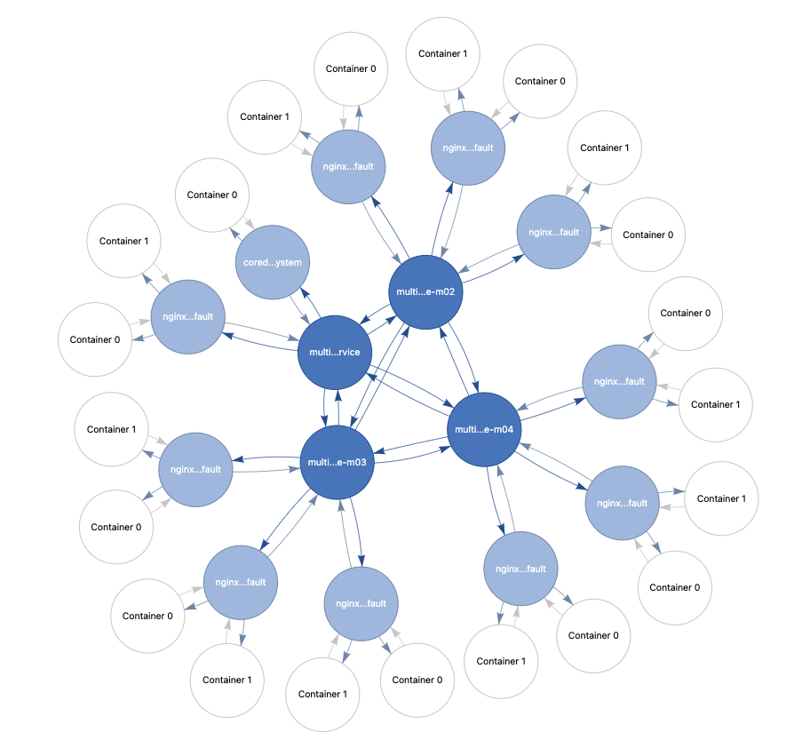
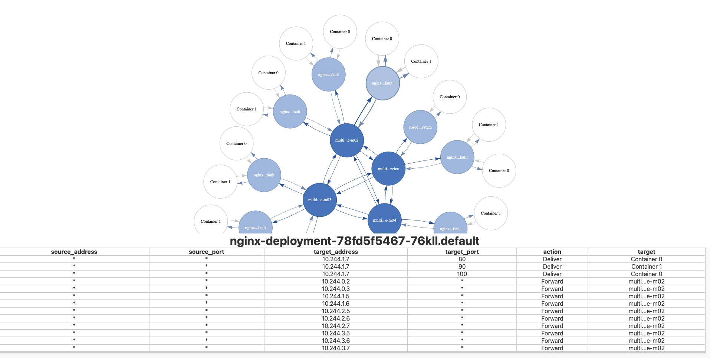

# Kubernetes Networking Model Educational Tool

## Introduction

The inner-working of the Kubernetes Network can often being confusing when only given the individual components and their configurations. This educational tool provides an interactive way to inspect each component and their relationships among each other.

## Set-Up

1. Have a Kubernetes cluster running locally. The tool will visualize the network configurations and resources of your current Kubernetes cluster.
2. Navigate to this repository's folder and type the following commands. This project has been packaged as a kubectl plugin.

```
sudo chmod +x ./plugin/kubectl-network
sudo cp ./plugin/kubectl-network /usr/local/bin
kubectl network
```

Access the running model at `http://localhost:8080`.

## How to Use

### Graph Nodes & Edges

When you load the model for the first time, you'll see graph nodes and edges. Each of the node represents a component of your cluster: the dark blue one as a Kubernetes node switch, the light blue one as a Kubernetes pod switch, and the white one as a container.

The graph edges represent a path for the exchange of a network path.



### Table

When you select either a Kubernetes node or pod switch, a table will be generated at the bottom of your screen. This is the Forward Information Base. For this network model, we visualize the logic to handle an incoming network packet at each of the switch.

The switch compares the labels of a packet against the table to determine where the packet should go next. In the example of the image below, if a packet with any source address and port and a target address and port of 10.244.1.7:90 is received at that pod switch, then the action the pod switch will take on the packets is to **deliver to Container 1**.



## Example

Check out the full [example site](https://maeganjong.github.io/Kubernetes-Network/).
